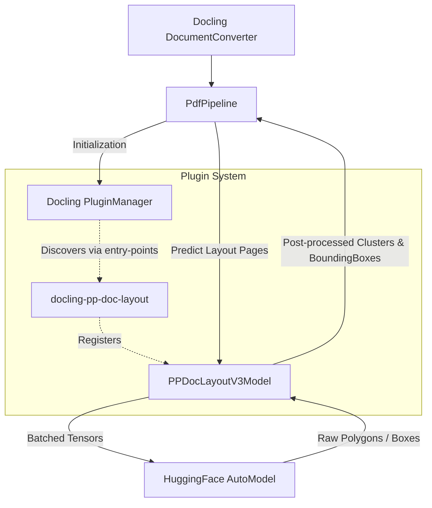

# docling-pp-doc-layout

A [Docling](https://github.com/docling-project/docling) plugin that provides document layout detection using the PaddlePaddle PP-DocLayout-V3 model.

This plugin seamlessly integrates with Docling's standard pipeline to replace the default layout models with [PP-DocLayout-V3](https://huggingface.co/PaddlePaddle/PP-DocLayoutV3), enabling high-accuracy, instance segmentation-based layout analysis with polygon bounding box support, properly processed in optimized batches for enterprise scalability.

---

<p align="center">
  <a href="https://github.com/DCC-BS/docling-pp-doc-layout">GitHub</a>
  &nbsp;|&nbsp;
  <a href="https://pypi.org/project/docling-pp-doc-layout/">PyPI</a>
</p>

---

[](https://pypi.org/project/docling-pp-doc-layout/)
[](https://pypi.org/project/docling-pp-doc-layout/)
[](https://github.com/DCC-BS/docling-pp-doc-layout/blob/main/LICENSE)
[](https://github.com/DCC-BS/docling-pp-doc-layout/actions/workflows/main.yml)
[](https://github.com/astral-sh/ruff)
[](https://codecov.io/gh/DCC-BS/docling-pp-doc-layout)


## Overview

`docling-pp-doc-layout` provides the `PPDocLayoutV3Model` layout engine for Docling. It automatically registers itself into Docling's plugin system upon installation. When configured in a Docling `DocumentConverter`, it intercepts page images, batches them, and infers document structural elements (text, tables, figures, headers, etc.) using HuggingFace's transformers library.

Key Features:
- **High Accuracy Layout Parsing**: Uses the RT-DETR instance segmentation framework.
- **Polygon Conversion**: Gracefully flattens complex polygon masks to Docling-compatible bounding boxes.
- **Enterprise Scalability**: Configurable batch sizing avoids out-of-memory (OOM) errors on large documents.

## Architecture & Integration

When you install this package, Docling discovers it automatically through standard Python package entry points.



## Requirements

- Python 3.13+
- `docling>=2.73`
- `transformers>=5.1.0`
- `torch`

## Installation

```bash
# with uv (recommended)
uv add docling-pp-doc-layout

# with pip
pip install docling-pp-doc-layout
```

## Usage

Using `docling-pp-doc-layout` is exactly like configuring standard Docling options.

```python
from docling.document_converter import DocumentConverter, PdfFormatOption
from docling.datamodel.pipeline_options import PdfPipelineOptions
from docling_pp_doc_layout.options import PPDocLayoutV3Options

# 1. Define Pipeline Options
pipeline_options = PdfPipelineOptions()

# 2. Configure our custom PPDocLayoutV3Options
pipeline_options.layout_options = PPDocLayoutV3Options(
    batch_size=8,                  # Tweak for GPU VRAM usage
    confidence_threshold=0.5,      # Filter low-confidence detections
    model_name="PaddlePaddle/PP-DocLayoutV3_safetensors" # Target HuggingFace model repo
)

# 3. Create the converter
converter = DocumentConverter(
    format_options={
        "pdf": PdfFormatOption(pipeline_options=pipeline_options)
    }
)

# 4. Convert Document
result = converter.convert("path/to/your/document.pdf")
print("Converted elements:", len(result.document.elements))
```

## Configuration Options

The `PPDocLayoutV3Options` dataclass gives you full control over the engine:

| Parameter               | Type    | Default | Description |
|-------------------------|---------|---------|-------------|
| `batch_size`            | `int`   | 8       | How many pages to process per single step. Decrease to lower memory usage; Increase to speed up processing of large documents. |
| `confidence_threshold`  | `float` | 0.5     | The minimum confidence score (0.0 - 1.0) required to keep a layout detection cluster. |
| `model_name`            | `str`   | `"PaddlePaddle/PP-DocLayoutV3_safetensors"` | HuggingFace repository ID. Allows overriding if you host your local copy or a fine-tuned version. |


## Development

If you wish to contribute or modify the plugin locally:

```bash
git clone https://github.com/DCC-BS/docling-pp-doc-layout.git
cd docling-pp-doc-layout

# Install dependencies and pre-commit hooks
make install

# Run checks (ruff, ty) and tests (pytest)
make check
make test
```

## License

[MIT](LICENSE) © DCC Data Competence Center
