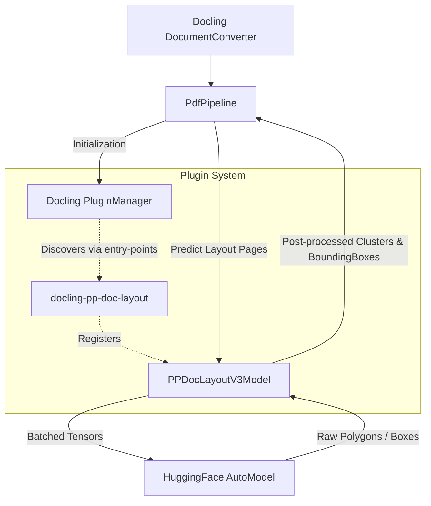

# docling-pp-doc-layout

A [Docling](https://github.com/docling-project/docling) plugin that provides document layout detection using the PaddlePaddle PP-DocLayout-V3 model.

This plugin seamlessly integrates with Docling's standard pipeline to replace the default layout models with [PP-DocLayout-V3](https://huggingface.co/PaddlePaddle/PP-DocLayoutV3), enabling high-accuracy, instance segmentation-based layout analysis with polygon bounding box support, properly processed in optimized batches for enterprise scalability.

---

<p align="center">
  <a href="https://github.com/DCC-BS/docling-pp-doc-layout">GitHub</a>
  &nbsp;|&nbsp;
  <a href="https://pypi.org/project/docling-pp-doc-layout/">PyPI</a>
</p>

---

[](https://pypi.org/project/docling-pp-doc-layout/)
[](https://pypi.org/project/docling-pp-doc-layout/)
[](https://github.com/DCC-BS/docling-pp-doc-layout/blob/main/LICENSE)
[](https://github.com/DCC-BS/docling-pp-doc-layout/actions/workflows/main.yml)
[](https://github.com/astral-sh/ruff)
[](https://codecov.io/gh/DCC-BS/docling-pp-doc-layout)


## Overview

`docling-pp-doc-layout` provides the `PPDocLayoutV3Model` layout engine for Docling. It automatically registers itself into Docling's plugin system upon installation. When configured in a Docling `DocumentConverter`, it intercepts page images, batches them, and infers document structural elements (text, tables, figures, headers, etc.) using HuggingFace's transformers library.

Key Features:
- **High Accuracy Layout Parsing**: Uses the RT-DETR instance segmentation framework.
- **Polygon Conversion**: Gracefully flattens complex polygon masks to Docling-compatible bounding boxes.
- **Enterprise Scalability**: Configurable batch sizing avoids out-of-memory (OOM) errors on large documents.

## Architecture & Integration

When you install this package, Docling discovers it automatically through standard Python package entry points.


```mermaid
flowchart TD
    A[Docling DocumentConverter] --> B[PdfPipeline]

    subgraph Plugin System
    C[Docling PluginManager] -.->|Discovers via entry-points| D[docling-pp-doc-layout]
    D -.->|Registers| E[PPDocLayoutV3Model]
    end

    B -->|Initialization| C
    B -->|Predict Layout Pages| E
    E -->|Batched Tensors| F[HuggingFace AutoModel]
    F -->|Raw Polygons / Boxes| E
    E -->|Post-processed Clusters & BoundingBoxes| B
```

## Requirements

- Python 3.13+
- `docling>=2.73`
- `transformers>=5.1.0`
- `torch`

## Installation

```bash
# with uv (recommended)
uv add docling-pp-doc-layout

# with pip
pip install docling-pp-doc-layout
```

## Usage

Using `docling-pp-doc-layout` is exactly like configuring standard Docling options.

```python
from docling.document_converter import DocumentConverter, PdfFormatOption
from docling.datamodel.pipeline_options import PdfPipelineOptions
from docling_pp_doc_layout.options import PPDocLayoutV3Options

# 1. Define Pipeline Options
pipeline_options = PdfPipelineOptions()

# 2. Configure our custom PPDocLayoutV3Options
pipeline_options.layout_options = PPDocLayoutV3Options(
    batch_size=8,  # Tweak for GPU VRAM usage
    confidence_threshold=0.3,  # Filter low-confidence detections
    model_name="PaddlePaddle/PP-DocLayoutV3_safetensors",  # Target HuggingFace model repo
)

# 3. Create the converter
converter = DocumentConverter(format_options={"pdf": PdfFormatOption(pipeline_options=pipeline_options)})

# 4. Convert Document
result = converter.convert("path/to/your/document.pdf")
print("Converted elements:", len(result.document.elements))
```

## Configuration Options

All options can be set via environment variables (useful for Docker / Compose
deployments) or programmatically via `PPDocLayoutV3Options`.  Explicit
constructor arguments always take precedence over environment variables.

### Environment variables

| Variable | Description | Default |
|---|---|---|
| `PP_DOC_LAYOUT_MODEL_NAME` | HuggingFace model repository ID | `PaddlePaddle/PP-DocLayoutV3_safetensors` |
| `PP_DOC_LAYOUT_CONFIDENCE_THRESHOLD` | Minimum detection confidence (0.0–1.0) | `0.3` |
| `PP_DOC_LAYOUT_BATCH_SIZE` | Batch size for layout inference | `8` |
| `PP_DOC_LAYOUT_CREATE_ORPHAN_CLUSTERS` | Create clusters for orphaned elements (`true`/`false`) | `true` |
| `PP_DOC_LAYOUT_KEEP_EMPTY_CLUSTERS` | Retain empty clusters in results (`true`/`false`) | `false` |
| `PP_DOC_LAYOUT_SKIP_CELL_ASSIGNMENT` | Skip table-cell assignment (`true`/`false`) | `false` |
| `PP_DOC_LAYOUT_LIST_DETECTION` | List-item detection: `rules`, `heron` or `off` (see below) | `rules` |

Boolean variables accept `true`, `1`, `yes` (case-insensitive) as truthy values; any other value is treated as `false`.

### `PPDocLayoutV3Options`

The `PPDocLayoutV3Options` class gives you full control over the engine:

| Parameter               | Type    | Default | Description |
|-------------------------|---------|---------|-------------|
| `model_name`            | `str`   | `PP_DOC_LAYOUT_MODEL_NAME` env or `"PaddlePaddle/PP-DocLayoutV3_safetensors"` | HuggingFace repository ID. Allows overriding if you host your local copy or a fine-tuned version. |
| `confidence_threshold`  | `float` | `PP_DOC_LAYOUT_CONFIDENCE_THRESHOLD` env or `0.3` | The minimum confidence score (0.0–1.0) required to keep a layout detection cluster. Handwriting and text in photos often score 0.3–0.4, so higher values drop it. |
| `batch_size`            | `int`   | `PP_DOC_LAYOUT_BATCH_SIZE` env or `8` | How many pages to process per single step. Decrease to lower memory usage; Increase to speed up processing of large documents. |
| `create_orphan_clusters` | `bool` | `PP_DOC_LAYOUT_CREATE_ORPHAN_CLUSTERS` env or `True` | Create clusters for orphaned elements not assigned to any structure. |
| `keep_empty_clusters`   | `bool`  | `PP_DOC_LAYOUT_KEEP_EMPTY_CLUSTERS` env or `False` | Retain empty clusters in layout analysis results. |
| `skip_cell_assignment`  | `bool`  | `PP_DOC_LAYOUT_SKIP_CELL_ASSIGNMENT` env or `False` | Skip assignment of cells to table structures during layout analysis. |
| `list_detection`        | `str`   | `PP_DOC_LAYOUT_LIST_DETECTION` env or `"rules"` | How list items are found: `"rules"`, `"heron"` or `"off"` (see below). |

`create_orphan_clusters`, `keep_empty_clusters` and `skip_cell_assignment` configure docling's
layout post-processing. With docling 2.116 or newer, docling runs that step itself after OCR
(OCR only runs inside layout regions), so the plugin returns the raw detections. With older
docling the plugin post-processes its detections itself.


## Labels and lists

PP-DocLayout-V3 has 25 classes. Its HuggingFace `config.json` merges five of them
(`header_image` and `footer_image` into "header"/"footer", `display_formula` and
`inline_formula` into "formula", `vertical_text` into "text"), so the plugin maps the model's
own class list by class id. Inline formulas stay part of their text line, logos in page
headers and footers are page furniture, and bibliography entries (`reference_content`)
become list items; the block around them is dropped so docling keeps the entries.

The model has no list-item class. Without help, docling builds no lists from its layout:
bullet points come out as separate paragraphs starting with "·". `list_detection` restores them:

- `rules` (default): after OCR, when the text of every region is known, text regions whose
  lines start with a list marker become list items, and a region holding several items is
  split. Markers are bullet glyphs (including Symbol/Wingdings bullets from Word documents),
  enumerators that form a sequence (`1.`/`2.`, `a)`/`b)`, `(i)`/`(ii)`; a lone `12. März`
  stays text) and small isolated marks left of a line where OCR read nothing (bullets that
  OCR drops on scans or that the PDF draws as shapes). A one-column table whose lines all
  start with a bullet becomes a list. Table-of-contents lines, paragraph numbers such as
  `(1)` and EU amendment markers such as `►M3` are not list markers. No extra model; the
  time cost is negligible.
- `heron`: additionally runs docling's own layout model (Heron) next to PP-DocLayout-V3 and
  adopts its list-item boxes inside PP text regions; list items whose enumerator has no
  neighbour are turned back into text. Better on scans where OCR garbles the markers, about
  5-30 % slower (a second layout model).
- `off`: no list detection (bibliography entries still become list items; that is the label mapping).

On a benchmark with exact ground truth (list pages born-digital and scanned, traps such as
numbered headings, dates and amounts) and 14 real documents:

| | born-digital recall / precision | scanned recall / precision | false list items from traps |
|---|---|---|---|
| Heron (docling default layout) | 0.67 / 0.96 | 0.97 / 0.95 | 2 |
| PP-DocLayout-V3, `off` | 0 | 0 | 0 |
| PP-DocLayout-V3, `rules` | 1.00 / 1.00 | 0.86 / 1.00 | 0 |
| PP-DocLayout-V3, `heron` | 1.00 / 1.00 | 0.94 / 0.94 | 1 |

List detection runs after OCR, where docling has no plugin interface: the plugin wraps
`LayoutPostprocessor.postprocess` for the pages it laid out (docling >= 2.116). The wrapper
never breaks a conversion; if docling's internals change or detection fails, it logs a
warning and keeps docling's regions (lists then stay plain text).

## Development

If you wish to contribute or modify the plugin locally:

```bash
git clone https://github.com/DCC-BS/docling-pp-doc-layout.git
cd docling-pp-doc-layout

# Install dependencies and pre-commit hooks
make install

# Run checks (ruff, ty) and tests (pytest)
make check
make test
```

## License

[MIT](LICENSE) © DCC Data Competence Center
